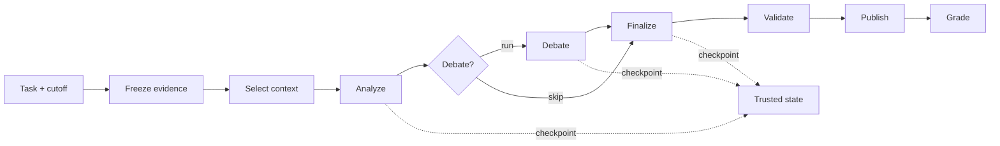

# TraceLane

> A trace-first harness for building and evaluating evidence-grounded agents.

[中文说明](README.zh-CN.md) · [Changelog](CHANGELOG.md)

Every run freezes its inputs, appends a trace, checkpoints trusted state, and
emits a graded answer. Same inputs, same artifacts — model swappable, nothing
hidden.

## Install & run

Requires Python 3.11 or 3.12.

```bash
git clone https://github.com/yyf0202/TraceLane.git
cd TraceLane
python -m venv .venv && source .venv/bin/activate
python -m pip install -e ".[dev]"
tracelane demo --artifacts artifacts/demo
tracelane inspect --run artifacts/demo/runs/<run-id>
```

Offline, deterministic, no API key. Runs against a real model too — see below.

## What you can do

- **Replay any run.** Point-in-time evidence freezing, content-addressed run
  ids, hash-chained checkpoints with trusted resume.
- **Grade it.** Completion, grounding, PIT, recovery, and cost graders.
- **Ablate a policy.** One variable per experiment — context budget, debate
  on/off — not one-off prompt comparisons.
- **Close the loop.** The `spine/` decision chain commits evidence-bound
  analyst signals, fuses them, resolves outcomes against the world, and feeds
  per-analyst reliability back into the next run:
  `tracelane decide ablate-debate …` · `tracelane decide ablate-feedback …`
- **Distill a real run.** `scripts/distill_research_showcase.py` turns a
  TradingAgents research trace into a sanitized, reproducible task.

Everything is offline and byte-reproducible by default.

## Use a live model

The default runtime is a deterministic stub. To hit a real OpenAI-compatible
endpoint, copy the template and fill in your key (`.local/` is git-ignored):

```bash
cp configs/runtime/openai-compatible.example.json .local/runtime.json
# edit .local/runtime.json: base_url, api_key, default_model
```

```bash
tracelane demo --artifacts artifacts/demo --runtime http
tracelane eval --suite fixtures/v0.1 --artifacts artifacts/eval \
  --runtime http --model glm-5.2
tracelane decide ablate-debate --suite fixtures/decision-v0.1 \
  --artifacts artifacts/decide --runtime http
```

Same grading, same hash chain — only the model changes. Live runs are
non-deterministic (the provider owns generation), so run ids differ from stub
runs. Ark Coding Plan: use the `/api/coding/v3` base URL for OpenAI-compatible;
`/api/coding` without `/v3` is the Anthropic endpoint.

## How it works



The orchestrator owns stages, checkpoints, validation, and publication. The
model enters through a narrow runtime interface, so swapping runtimes never
touches the artifact or evaluation protocol.

```text
artifacts/runs/<run-id>/
├── input/          # task, evidence, config, identity — frozen
├── trace/          # events.jsonl: model, tool, token, latency, stage
├── checkpoints/    # hash-chained trusted state
├── output/         # answer.json, grades.json
└── run.json
```

## Evaluation

```bash
tracelane eval --suite fixtures/v0.1 --artifacts artifacts/eval
tracelane ablate --suite fixtures/v0.1 \
  --variable context_policy --artifacts artifacts/ablate
```

Control and treatment arms share tasks, runtime, seed, and config. Only the
experiment variable moves.

## Checks

```bash
python -m ruff check . && python -m ruff format --check .
python -m pytest -q --ignore=tests/v2/test_hist001_fixture.py
python -m pytest tests/v2/test_hist001_fixture.py -q   # v0.2 release gate
```

## Docs

- [docs/decision-feedback-spine.md](docs/decision-feedback-spine.md) — the
  decision → outcome → feedback spine, ablation results, and design rationale.
- [docs/integrity-and-boundaries.md](docs/integrity-and-boundaries.md) —
  artifact integrity, threat model, migration and release-gate boundaries.

## Roadmap

- Deterministic fault injection and recovery experiments.
- Repeated runs and statistical summaries.
- Post-training-ready trace/grader JSONL export.
- Calibrated human and model graders.
- Model–harness co-evolution and learned workflow policies.

## License

Apache-2.0. See [LICENSE](LICENSE) and [NOTICE](NOTICE).
