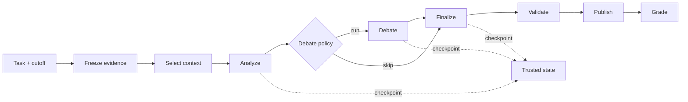

# TraceLane

> A trace-first harness for building and evaluating evidence-grounded agents.

[中文说明](README.zh-CN.md) · [Changelog](CHANGELOG.md)

TraceLane provides a small, reproducible environment for studying how agent
behavior changes with context policies, orchestration strategies, checkpoints,
and graders. Each run produces a complete set of inspectable artifacts: frozen
inputs, an append-only trace, trusted checkpoints, a structured answer, and
deterministic grades.

## Goals

- Make every agent run observable and reproducible.
- Separate model behavior from harness behavior.
- Turn context, debate, and recovery strategies into testable policies.
- Support controlled ablations instead of one-off prompt comparisons.
- Produce traces and grader signals that can feed later evaluation and training work.

## Features

- Deterministic `gather → analyze → debate? → finalize → validate → publish` loop.
- Point-in-time evidence freezing with explicit cutoff timestamps.
- A content-addressed evidence registry for project-scoped candidate evidence
  and retained human review decisions.
- Raw and budgeted context-selection policies.
- Conditional and always-on debate policies.
- Content-addressed run identities and canonical JSON artifacts.
- Append-only JSONL traces with model, tool, token, latency, and stage events.
- Atomic writes and hash-chained checkpoints with trusted resume.
- Completion, grounding, point-in-time, recovery, and operational graders.
- A deterministic twelve-task synthetic benchmark.
- One-variable context-policy ablations with isolated experiment arms.
- Offline `demo`, `eval`, `ablate`, and `inspect` commands.

The tracked HIST-001 registry contains nine pending candidates, no approvals or
reviews, and one post-cutoff future-information control. Verification derives
project and global indexes from authenticated source inventory, candidate,
review, transformation, and blob records before accepting persisted indexes.

The public `fixtures/v0.2` package remains intentionally absent and unapproved.
Its test is a release gate: a missing-fixture failure is expected until a
separate review explicitly approves and publishes that fixture.

## Quick start

TraceLane requires Python 3.11 or 3.12.

```bash
git clone https://github.com/yyf0202/TraceLane.git
cd TraceLane
python -m venv .venv
source .venv/bin/activate  # Windows PowerShell: .\.venv\Scripts\Activate.ps1
python -m pip install -e ".[dev]"
tracelane demo --artifacts artifacts/demo
```

Inspect the generated run:

```bash
tracelane inspect --run artifacts/demo/runs/<run-id>
```

The default demo is fully offline and does not require an API key.

## Local model configuration (v0.2)

The v0.2 hosted runtime uses a private configuration that remains on the local
machine. Copy the public template first:

```powershell
New-Item -ItemType Directory -Force .local | Out-Null
Copy-Item configs/runtime/openai-compatible.example.json .local/runtime.json
```

Edit `.local/runtime.json` and set your own `api_key`, model list, and default
model. `.local/` is ignored by Git; the committed example contains placeholders
only.

```json
{
  "protocol": "openai-compatible",
  "base_url": "https://ark.cn-beijing.volces.com/api/coding/v3",
  "api_key": "replace-with-your-local-api-key",
  "models": ["deepseek-v4-pro", "glm-5.2"],
  "default_model": "deepseek-v4-pro"
}
```

For Ark Coding Plan, the OpenAI-compatible base URL uses `/api/coding/v3`;
`/api/coding` without `/v3` is the Anthropic-compatible endpoint. Treat the
provider's current documentation and console as authoritative.

The private file supplies credentials only at process startup. Traces, run
manifests, public runtime configs, and exports must never contain `api_key`.
`.gitignore` is not a secret vault: rotate any key that has appeared in chat,
logs, or Git history.

The current v0.1 release does not read this file; it defines the configuration
contract for the v0.2 hosted runtime.

## How it works



The orchestrator owns stage transitions, paths, checkpoint trust, validation,
and publication. Model behavior enters through a narrow runtime interface, so a
runtime can be replaced without changing the artifact and evaluation protocols.

## Run artifacts

```text
artifacts/runs/<run-id>/
├── input/
│   ├── task.json
│   ├── evidence.json
│   ├── config.json
│   └── identity.json
├── trace/events.jsonl
├── checkpoints/
├── output/
│   ├── answer.json
│   └── grades.json
└── run.json
```

The run identity is derived from the task, frozen evidence bundle, harness
configuration, model ID, and repeat number. Reopening the same run verifies the
checkpoint chain before resuming.

## Artifact integrity

TraceLane verifies internal consistency: hashes, references, trace order,
approval bindings, and complete run contents. It detects corruption and
partial or stale substitutions. It does not claim authenticity against an
attacker who can rewrite every artifact and Git history; a published Git
commit or release digest is the external anchor.

Manual acquisition uses a per-session lock and an authenticated operation
journal for both ingest and promotion. Recovery validates the complete base
inventory before materializing pending documents, validates the merged
inventory, publishes the session manifest last, and removes the journal only
after the published manifest is reread successfully.

Promoted evidence can be archived into another artifact root without rewriting
its references. The archive authenticates the evidence record, candidate,
approval review, curated content, and ordered transformations before copying,
then recreates each original `tracelane://artifacts/...` path with the same
digest, size, and bytes. An identical archive is idempotent; conflicting target
bytes are never overwritten. This archive protocol does not itself create or
approve a public historical fixture.

Trace payloads and free-text mapping keys retain redaction, while structural
trace identities fail closed when their final serialized values collide with a
configured secret. Identity fields are not redacted because changing them
would invalidate the trace hash chain.

## Evaluation

Run the complete synthetic suite:

```bash
tracelane eval \
  --suite fixtures/v0.1 \
  --artifacts artifacts/eval
```

Run a context-policy ablation:

```bash
tracelane ablate \
  --suite fixtures/v0.1 \
  --variable context_policy \
  --artifacts artifacts/ablate
```

The control and treatment arms use the same tasks, model runtime, seed, and
harness configuration. Only the selected experiment variable changes.

Current graders cover:

- required-fact completion;
- citation precision and recall;
- unsupported claims;
- post-cutoff evidence use;
- checkpoint recovery and repeated stages;
- model/tool calls, tokens, latency, and retries.

## Reproducibility

- Fixtures are synthetic and generated without network access or current time.
- The suite manifest stores hashes for every task and the generator.
- Schemas reject unknown fields and malformed structured outputs.
- Canonical serialization rejects non-finite numbers.
- Fixed-clock golden tests lock normalized output.
- Core artifacts are byte-stable across different output directories.

### Migration trust boundary

The v1-to-v2 importer is a local, operator-controlled migration boundary. It
copies a selected v1 run without executing its contents or using the network,
rejects linked trees and a target/import tree placed inside the selected
source, and binds the source and copied payload to explicit file inventories
and root digests. A target outside the source may contain the source; this is
not rejected as an overlap. The importer also verifies that the source remains
unchanged throughout the copy. Each migrated file is published atomically, and
the migration is considered complete only after an authenticated completion
marker covers the published inventory.

Those hashes prove internal snapshot consistency; they do not establish who
created the v1 source or whether its claims are true. Operators must select a
trusted local source. For published experiments, the repository commit and
release digest remain the external publication anchor.

Run the local checks:

```bash
python -m ruff check .
python -m ruff format --check .
python -m pytest -q
```

## Roadmap

- Add runtime adapters for hosted and local language models.
- Add deterministic fault injection and automatic recovery experiments.
- Expand benchmark development and held-out splits.
- Support repeated experiment runs and statistical summaries.
- Add debate-policy and recovery-policy ablations.
- Export post-training-ready trace and grader JSONL.
- Add calibrated human and model-based graders.
- Grow project-scoped evidence registries through explicit human review.
- Explore model–harness co-evolution and learned workflow policies.

## License

TraceLane is licensed under Apache-2.0. See [LICENSE](LICENSE) and
[NOTICE](NOTICE).
