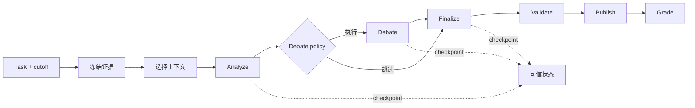

# TraceLane

> 一个用于构建和评测证据型 Agent 的 trace-first Harness。

[English README](README.md) · [更新日志](CHANGELOG.md)

TraceLane 提供一个小型、可复现的 Agent 实验环境，用于研究 context policy、
编排策略、checkpoint 和 grader 如何影响 Agent 行为。每次运行都会生成完整的
可检查产物：冻结输入、追加式 trace、可信 checkpoint、结构化答案和确定性评分。

## 项目目标

- 让每次 Agent 运行都可观测、可检查、可复现；
- 将模型行为与 Harness 行为分离；
- 将 context、debate、recovery 变成可配置和可测试的策略；
- 用受控 ablation 代替一次性的 Prompt 对比；
- 生成可用于后续评测和训练工作的 trace 与 grader signal。

## 当前功能

- 确定性的 `gather → analyze → debate? → finalize → validate → publish` Agent Loop；
- 基于截止时间的 Point-in-Time 证据冻结；
- Raw 与带预算的 context selection；
- Conditional 与 Always-On debate policy；
- 内容寻址的 run identity 与 canonical JSON artifacts；
- 记录模型、工具、token、延迟和阶段事件的 JSONL trace；
- 原子写入、哈希链 checkpoint 与可信恢复；
- Completion、Grounding、PIT、Recovery 和 Operational graders；
- 12 个确定性合成 benchmark 任务；
- 隔离 control/treatment 的单变量 context ablation；
- 离线 `demo`、`eval`、`ablate`、`inspect` 命令。

## 快速开始

TraceLane 需要 Python 3.11 或 3.12。

```bash
git clone https://github.com/yyf0202/TraceLane.git
cd TraceLane
python -m venv .venv
source .venv/bin/activate  # Windows PowerShell：.\.venv\Scripts\Activate.ps1
python -m pip install -e ".[dev]"
tracelane demo --artifacts artifacts/demo
```

检查生成的运行：

```bash
tracelane inspect --run artifacts/demo/runs/<run-id>
```

默认 Demo 完全离线，不需要 API Key。

## 本地模型配置（v0.2）

v0.2 的 Hosted Runtime 使用一个只保存在本机的私有配置。先复制公开模板：

```powershell
New-Item -ItemType Directory -Force .local | Out-Null
Copy-Item configs/runtime/openai-compatible.example.json .local/runtime.json
```

然后编辑 `.local/runtime.json`，填写自己的 `api_key`、模型列表和默认模型。`.local/`
已经加入 `.gitignore`，不会进入正常的 Git 提交；公开模板只包含占位值。

```json
{
  "protocol": "openai-compatible",
  "base_url": "https://ark.cn-beijing.volces.com/api/coding/v3",
  "api_key": "replace-with-your-local-api-key",
  "models": ["deepseek-v4-pro", "glm-5.2"],
  "default_model": "deepseek-v4-pro"
}
```

方舟 Coding Plan 的 OpenAI-compatible Base URL 需要 `/api/coding/v3`；不带 `/v3`
的 `/api/coding` 是 Anthropic-compatible 入口。以服务商当前文档和控制台为准。

私有配置只负责在进程启动时提供凭证。Trace、Run Manifest、Runtime Config 和导出文件
只记录非秘密字段，不得保存 `api_key`。`.gitignore` 不是密钥保险箱：一旦 Key 曾经
进入聊天、日志或 Git 历史，应立即在服务商控制台吊销并重新生成。

当前 v0.1 尚不会读取该文件；它是 v0.2 Hosted Runtime 的配置约定。

## 工作流程



Orchestrator 负责阶段迁移、路径、checkpoint 信任、校验和发布。模型通过窄化后的
Runtime 接口参与运行，因此替换模型 Runtime 不需要改变 artifact 和 eval 协议。

## 运行产物

```text
artifacts/runs/<run-id>/
├── input/
│   ├── task.json
│   ├── evidence.json
│   ├── config.json
│   └── identity.json
├── trace/events.jsonl
├── checkpoints/
├── output/
│   ├── answer.json
│   └── grades.json
└── run.json
```

`run_id` 由 task、冻结 evidence bundle、Harness config、model ID 和 repeat
共同生成。重新打开同一次运行时，系统会先校验完整 checkpoint 哈希链再恢复。

## Eval 与 Ablation

运行完整合成测试集：

```bash
tracelane eval \
  --suite fixtures/v0.1 \
  --artifacts artifacts/eval
```

运行 context policy 消融实验：

```bash
tracelane ablate \
  --suite fixtures/v0.1 \
  --variable context_policy \
  --artifacts artifacts/ablate
```

Control 与 treatment 使用相同的任务、模型 Runtime、seed 和 Harness 配置，
只改变被选中的实验变量。

当前 graders 包括：

- 必需 facts 的完成度；
- Citation precision 与 recall；
- Unsupported claims；
- Cutoff 后证据使用；
- Checkpoint recovery 与重复阶段；
- Model/tool calls、token、延迟与重试。

## 可复现性

- Fixtures 全部为合成数据，生成过程不读取网络或当前时间；
- Suite manifest 保存每个任务和生成器的哈希；
- Schema 拒绝未知字段和非法结构化输出；
- Canonical serialization 拒绝 NaN 与 Infinity；
- 固定时钟 golden test 锁定标准化输出；
- 核心 artifacts 在不同输出目录下逐字节一致。

本地验证：

```bash
python -m ruff check .
python -m ruff format --check .
python -m pytest -q
```

## Roadmap

- 接入云端与本地语言模型 Runtime；
- 增加确定性 fault injection 和自动恢复实验；
- 扩展 benchmark 的开发集与 held-out 集；
- 支持重复实验与统计汇总；
- 增加 debate policy 与 recovery policy ablation；
- 导出 post-training 可消费的 trace/grader JSONL；
- 增加经过校准的人工与模型 grader；
- 探索 Model–Harness co-evolution 和可学习 workflow policy。

## License

TraceLane 采用 Apache-2.0 许可证，详见 [LICENSE](LICENSE) 与 [NOTICE](NOTICE)。
